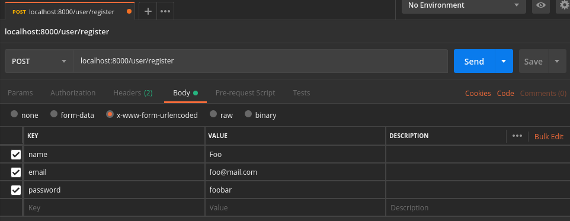
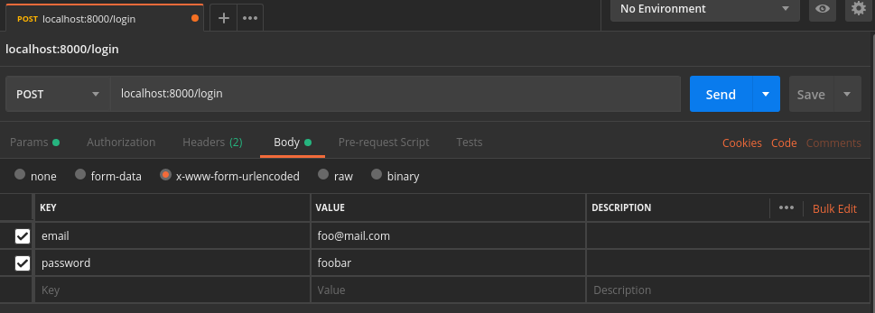
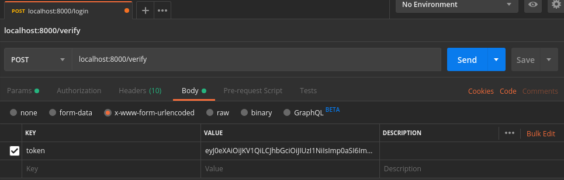

# MicroAuth

MicroAuth use JWT technology to serve you a easy way to authenticate users.

## Getting Started

These instructions will get you a copy of the project up and running. 

### Prerequisites

```
php >= 7.1
mysql
composer
```

### Installing

Clone or download this project to your local.

```
git clone https://github.com/viniciosanacleto/microauth.git
```

Enter the project folder and install dependencies

```
cd microauth
composer install
```

Copy the `.env.example` to a `.env` named file.

In `.env` file set the your database configurations

```
//.env

DB_CONNECTION=mysql
DB_HOST=127.0.0.1
DB_PORT=3306
DB_DATABASE=your_database
DB_USERNAME=your_username
DB_PASSWORD=your_password
```

Still on the `.env`, you need to set a string to serve as a signature for each generated token.
Recommend to use a strong string.

```
//.env

AUTH_SIGNATURE=your_strong_signature
```

The last thing we need to do is migrate our database.
```
php artisan migrate
```

That's it, your MicroAuth instance is ready to go.

## Usage

For test purpose we gonna run the local server.
```
php artisan serve
```
Each request to MicroAuth needs to inform the source application token on `Authentication` header.
To generate a new source token use:

```
php artisan auth:new-source name_of_my_application
```

A new token will be generated. Remember, this token is the key that your application use to access the
MicroAuth service, so save it in a secure place. If you lost your source token you need to generate a new one.

Now with the source token in hands we can register our first user using the route `/user/register` with 
`POST` method:


**Remember to set the `Authorization` header with your source token generated before.**

If all goes right your response will be:
```json
{
    "success": true,
    "data": null
}
```

Now your user can log in using the route `/login` with `POST` method:

**Remember to set the `Authorization` header with your source token generated before.**

The result of this request will be something like this:
```json
{
    "success": true,
    "data": {
        "token": "generated_token_here",
        "loginAt": "2019-06-23 16:52:27"
    }
}
```
Voilà! The user JWT was now generated and can be verified ever is needed. To verify if a user token is
valid just request to `/verify` with `POST` method:

**Remember to set the `Authorization` header with your source token generated before.**

If the token is valid the response will be something like this:
```json
{
    "success": true,
    "data": {
        "token": "your_token",
        "valid": true
    }
}
```

## Observations

By default the expiration time of the generated tokens will be `3600 seconds` (a.k.a 1 hour). This is configurable
in `.env`:
```
//.env
AUTH_TOKEN_EXPIRATION_TIME=3600
```

## Built With

* [Lumen](https://lumen.laravel.com/) - The stunningly fast micro-framework by Laravel.
* [Composer](https://getcomposer.org/) - Dependency Management
* [JWT](https://jwt.io/) - JSON Web Tokens
* [lcobucci/jwt](https://github.com/lcobucci/jwt) - JWT Implementation by Luís Cobucci

## Authors

* **Vinicios Anacleto** - *Initial work* - [Github](https://github.com/viniciosanacleto)

See also the list of [contributors](https://github.com/viniciosanacleto/microauth/graphs/contributors) who participated in this project.

## License

This project is licensed under the MIT License - see the [LICENSE.md](LICENSE.md) file for details

